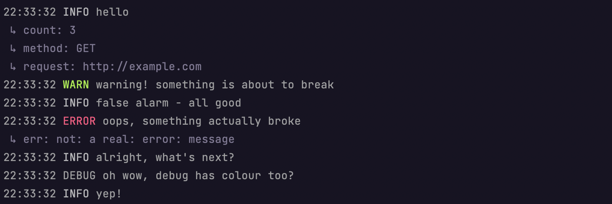

# devslog

<center></center>

Package devslog provides a [log/slog](https://pkg.go.dev/log/slog) handler
that formats records where message is followed by each of it's attributes
on seperate lines.

It implements the `slog.Handler` interface to format the record's message.

The default `slog.TextHandler` output adds year/month/date which I rarely find
useful when working on code locally. This is what `slog.TextHandler` default
output looks like:

```sh
2022/11/08 15:28:26 INFO hello count=3 method=GET request=http://example.com
```

This package turns the above message into this:

```sh
15:28:26 INFO hello
 ↳ count: 3
 ↳ method: GET
 ↳ request: http://example.com
```

The devslog handler can be set as the default logger with:

```go
devslog.SetDefault(os.Stdout, &slog.HandlerOptions{
    Level: slog.LevelDebug,
})
```

The top-level slog functions `slog.Info`, `slog.Debug`, etc will all use this
handler to format the records. `SetDefault` also updates the default logger
used by the [log](https://pkg.go.dev/log) package, so that existing applications
that use `log.Printf` and related functions will send log records to the logger's
handler without needing to be rewritten.
